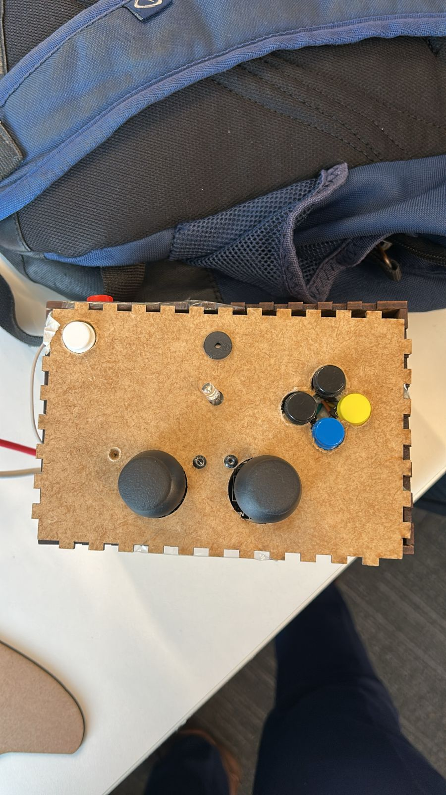

# Controle Customizado para Shell Shockers

Este repositório reúne o firmware em C para Raspberry Pi Pico e o script em Python que, juntos, implementam um controle físico para o jogo **Shell Shockers**.

---

## Jogo

**Shell Shockers** – jogo de tiro em primeira pessoa que roda em navegador, onde cada jogador controla um ovo armado. A jogabilidade utiliza:
- Mira e disparo via mouse  
- Movimentação e comandos adicionais via teclado (W/A/S/D, espaço, R, etc.)  

Nosso objetivo é substituir mouse e teclado por um controle dedicado, mais imersivo e ergonômico.

---

## Ideia do Controle

- **Microcontrolador**: Raspberry Pi Pico  
- **Joysticks**: 2 sticks analógicos, cada um com eixos X/Y, multiplexados por CD4051 → 4 canais ADC  
- **Botões de Ação** (GPIO 16–20):  
  1. Mira   
  2. Atirar   
  3. Pular   
  4. Recarregar   
  5. Trocar de arma   
- **Botão ENABLE** (GPIO 14): liga/desliga o envio de comandos  
- **Indicador Visual**: LED (GPIO 2) sinaliza estado do controle ligado  
- **Feedback Sonoro**: buzzer (GPIO 15) simula som de tiro  
- **Comunicação**: dados enviados ao PC por UART; script Python usa PyAutoGUI para mover o mouse e disparar cliques

---

## Inputs e Outputs

### Entradas (Inputs)

| Dispositivo               | Conexão           |
|:-------------------------:|:-----------------:|
| 1 × Joysticks (X/Y)       | ADC via MUX (canais 0 e 3) |
| 1 × Joysticks (WASD)      | ADC via MUX (canais 1 e 2) |
| 5 × Botões de Ação        | GPIO 16–20        |
| 1 × Botão ENABLE          | GPIO 14           |

### Saídas (Outputs)

| Dispositivo              | Conexão           |
|:------------------------:|:-----------------:|
| LED Indicador            | GPIO 2            |
| Buzzer (som de tiro)     | GPIO 15           |
| UART (pacotes de comando)| USB Serial        |

---

## Protocolo Utilizado

- **UART** (Universal Asynchronous Receiver/Transmitter)  
- **GPIO Interrupts**  
  - `gpio_callback` para botões de ação e botão ENABLE  
---

### Estrutura Geral

---

---

---

## Principais Componentes do RTOS

- **Tasks**  
  - `x_task` / `y_task`: leem ADC de joystick (canais 2–3), calculam média móvel e enviam `adc_t` para `xQueueADC`  
  - `direcional_task`: lê ADC (canais 0–1) para comandos WASD e envia diretamente via UART  
  - `uart_task`: consome `xQueueADC`, empacota bytes e transmite pela UART  
  - `botao_task`: consome `xQueueBotoes`, empacota comandos de botão, transmite via UART e dispara `gerar_buzzer_tiro()` em “atirar”  

- **Filas (Queues)**  
  - `xQueueADC`: eventos analógicos  
  - `xQueueBotoes`: eventos de botão  

- **Semáforos / Flags**  
  - `sending_enabled`: controla se as tasks enviam comandos  

- **Interrupts**  
  - `gpio_callback()`: callback único para GPIOs de botões e botão ENABLE  

---

## Imagens do Controle

### Proposta Inicial

---

---

### Controle Final

---

---

